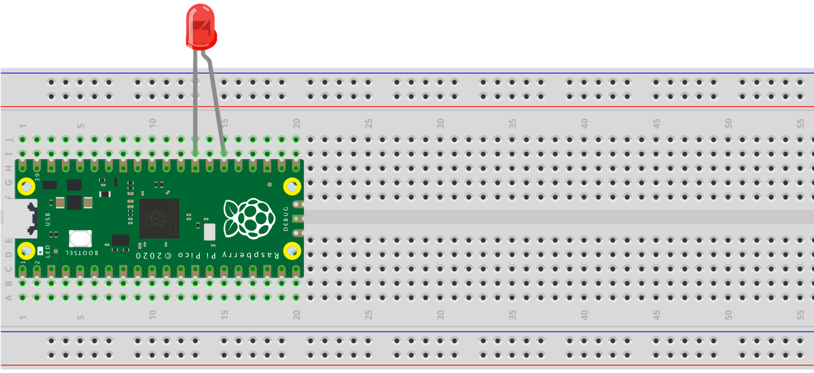

# rp2040_plc на основе RP2040-FreeRTOS Template 1.4.2

Данный репозиторий основан на [этом шаблоне](https://github.com/smittytone/RP2040-FreeRTOS)

В этом репозитории содерджится [FreeRTOS](https://freertos.org/) для [Raspberry Pi RP2040 microcontroller](https://www.raspberrypi.com/products/rp2040/).

Больше деталей [в этом посте](https://blog.smittytone.net/2022/02/24/how-to-use-freertos-with-the-raspberry-pi-pico/).

## Структура проекта

```
/rp2040_plc
|___/App-plc                // Application generation C-code for plc source code (C)
|   |___CMakeLists.txt      // Application-level CMake config file
|
|___/App-Template           // Application 1 (FreeRTOS template) source code (C)
|   |___CMakeLists.txt      // Application-level CMake config file
|
|___/Common                 // Source code common to applications 2-4 (C++)
|
|___/Config
|   |___FreeRTOSConfig.h    // FreeRTOS project config file
|
|___/FreeRTOS-Kernel        // FreeRTOS kernel files, included as a submodule
|___/pico-sdk               // Raspberry Pi Pico SDK, included as a submodule
|
|___CMakeLists.txt          // Top-level project CMake config file
|___pico_sdk_import.cmake   // Raspberry Pi Pico SDK CMake import script
|___deploy.sh               // Build-and-deploy shell script
|
|___rp2040.code-workspace   // Visual Studio Code workspace
|___rp2040.xcworkspace      // Xcode workspace
|
|___README.md
|___LICENSE.md
```

## Требования

Для использования этого репозитория ваша система должна быть готова к разхработке для RP2040 C/C++. [В посте от автора шаблона](https://blog.smittytone.net/2021/02/02/program-raspberry-pi-pico-c-mac/) описаны детали установки.

## Использование

1. Склонируйте этот репозиторий: `git clone https://github.com/BobrJC/rp2040_plc`.
1. Войдите в него: `cd rp2040_plc`.
1. Установите дочерние модули: `git submodule update --init --recursive`.
1. Опционально измените `CMakeLists.txt` и `/<Application>/CMakeLists.txt` чтобы переименовать проект или подключить другие библиотеки.
1. Опционально самостоятельно сконфигурируйте сборку: `cmake -S . -B build/`.
1. Опционально соберите проект: `cmake --build build`.
1. Подключите свою плату (с зажатой кнопкой boot).
1. Установите приложение: `./deploy.sh`.
    * Передайте параметром приложение, которое хотите загрузить:
        * `./deploy.sh build/App-Template/TEMPLATE.uf2`.
        * `./deploy.sh build/App-Scheduling/SCHEDULING_DEMO.uf2`.
    * Чтобы в процессе загрузки собрать приложение добавьте флаг `--build` или `-b`: `./deploy.sh -b`.

## Debug vs Release

You can switch between build types when you make the `cmake` call in step 5, above. A debug build is made explicit with:

```shell
cmake -S . -B build -D CMAKE_BUILD_TYPE=Debug
```

For a release build, which among various optimisations omits UART debugging code, call:

```shell
cmake -S . -B build -D CMAKE_BUILD_TYPE=Release
```

Follow both of these commands with the usual

```shell
cmake --build build
```


## The Apps

This repo includes a number of deployable apps. The project builds them all, sequentially. Exclude apps from the build process by commenting out their `add_subdirectory()` lines in the top-level `CMakeLists.txt`.

### App One: Template

This C app provides a simple flip-flop using an on-board LED and an LED wired between GPIO 20 and GND. The board LED flashes every 500ms under one task. When its state changes, a message containing its state is added to a FreeRTOS inter-task xQueue. A second task checks for an enqueued message: if one is present, it reads the message and sets the LED it controls — the GPIO LED — accordingly to the inverse of the board LED’s state.



The code demonstrates a basic FreeRTOS setup, but you can replace it entirely with your own code if you’re using this repo’s contents as a template for your own projects.

## IDEs

Workspace files are included for the Visual Studio Code and Xcode IDEs.

## Credits

This work was inspired by work done on [Twilio Microvisor FreeRTOS Demo code](https://github.com/twilio/twilio-microvisor-freertos), but the version of the `FreeRTOSConfig.h` file included here was derived from [work by @yunka2](https://github.com/yunkya2/pico-freertos-sample).

## Copyright and Licences

Application source © 2023, Tony Smith and licensed under the terms of the [MIT Licence](./LICENSE.md).

[FreeRTOS](https://freertos.org/) © 2021, Amazon Web Services, Inc. It is also licensed under the terms of the [MIT Licence](./LICENSE.md).

The [Raspberry Pi Pico SDK](https://github.com/raspberrypi/pico-sdk) is © 2020, Raspberry Pi (Trading) Ltd. It is licensed under the terms of the [BSD 3-Clause "New" or "Revised" Licence](https://github.com/raspberrypi/pico-sdk/blob/master/LICENSE.TXT).
